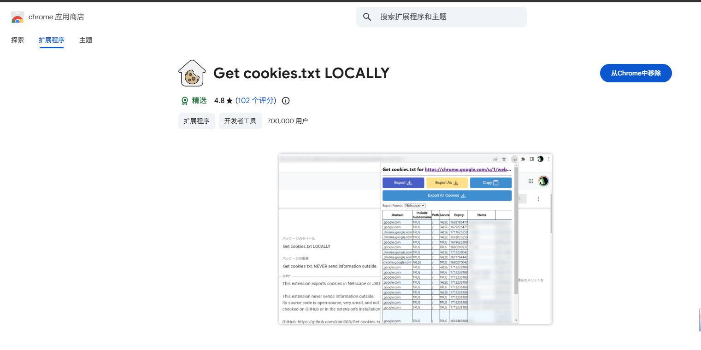
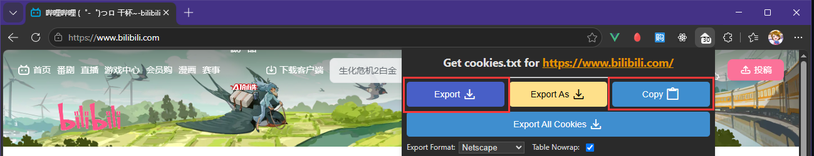

# 🔗 Link Resolver

[](https://github.com/AstrBotDevs/AstrBot)
[](LICENSE)

支持监听聊天中的 **B站** / **抖音** / **小红书** / **微博** / **X** / **NGA** 链接，自动解析并发送视频、图集或帖子截图。无需命令，发送链接即可触发。

---

## ✨ 特性

- 📺 **B站视频解析**：支持多种画质选择，支持多P视频批量下载
- 🎵 **抖音解析**：支持视频和图文笔记，自动下载并发送
- 📕 **小红书原图解析**：支持视频和图文笔记，可下载原图
- 🚦 **群过滤(黑/白名单)**：按群号控制哪些群启用解析，私聊不受影响
- 🐦 **微博解析**：支持单条微博正文、图片、视频，默认原图优先
- 𝕏 **X 解析**：支持 `twitter.com` / `x.com` 推文图片和视频解析
- 🧵 **NGA 解析**：支持帖子网页截图，并可下载主楼/热点区域的附件图片随消息发送
- 🧾 **摘要模式**：B站、抖音和小红书支持文字摘要或渲染卡片
- 🔤 **字体管理**：支持自定义字体，也可按需安装托管字体

---

## 安装与依赖

推荐直接从 AstrBot 插件市场安装。插件需要的 Python 包会根据 `requirements.txt` 自动安装。

B站音视频合并依赖系统中的 `ffmpeg`。安装后可在 AstrBot 的运行环境内执行下面的命令确认：

```bash
ffmpeg -version
```

插件配置和运行数据保存在 AstrBot 的 `data/plugin_data/astrbot_plugin_link_resolver/`，更新插件代码时不会被覆盖。

---

## ⚙️ 配置项
在 AstrBot 管理面板的插件配置中可调整以下选项：

配置面板按平台分组折叠。如果你是从旧版升级，建议重新检查一次配置值。

### 基础设置

| 配置项 | 说明 | 默认值 |
|--------|------|--------|
| `enable_platforms` | 勾选要启用解析的平台 | B站, 抖音, 小红书, 微博, X, NGA |
| `general_settings.retry_count` | 解析失败重试次数（所有平台共用） | 3 |
| `general_settings.max_video_size_mb` | 最大视频大小限制 (MB)，超过则跳过下载或自动降画质 | 200 |
| `general_settings.reaction_emoji_enabled` | 识别链接后是否发表情回应 | ✅ 开启 |
| `general_settings.reaction_emoji_list` | 回应表情 ID 列表(0~5个), 空=不回应 | `[127827]` |
| `general_settings.reaction_emoji_strategy` | `随机` 抽1个 / `顺序循环` 全部依次回应(每个 0.5s) | `随机` |
| `general_settings.auto_install_fonts` | 重载时自动安装字体到插件数据目录 | ❌ 关闭 |
| `general_settings.custom_font_path` | 自定义主字体文件绝对路径，优先级最高 | 空 |
| `general_settings.custom_emoji_font_path` | 自定义 Emoji 字体文件绝对路径，优先级最高 | 空 |
| `general_settings.merge_send_as_sender` | 合并转发显示为原发送者 | ❌ 关闭 |
| `general_settings.error_notify_mode` | 失败时群内通知模式 | `静默` |

### 群过滤设置

按群号限制哪些群启用解析。私聊不受过滤影响，始终放行。

| 配置项 | 说明 | 默认值 |
|--------|------|--------|
| `group_filter.mode` | 过滤模式：`黑名单`(列表内禁用)/ `白名单`(仅列表内启用) | `黑名单` |
| `group_filter.group_list` | 群号列表(QQ 群号,纯数字字符串) | `[]` |

**示例**：

```jsonc
"group_filter": {
    "mode": "黑名单",
    "group_list": ["123456789", "987654321"]   // 这两个群不解析
}
```

```jsonc
"group_filter": {
    "mode": "白名单",
    "group_list": ["123456789"]   // 只有这个群解析
}
```

### B站设置

| 配置项 | 说明 | 默认值 |
|--------|------|--------|
| `bili_settings.video_quality` | 默认下载画质 | `1080P高帧率` |
| `bili_settings.allow_quality_fallback` | 超限时自动降画质 | ✅ 开启 |
| `bili_settings.merge_send` | 合并转发发送（不开启则只发视频） | ❌ 关闭 |
| `bili_settings.summary_mode` | 合并发送时使用 `文字摘要` 或 `渲染卡片` | `文字摘要` |
| `bili_settings.enable_multi_page` | 启用多P视频下载 | ✅ 开启 |
| `bili_settings.multi_page_max` | 多P最多下载数量 | 3 |
| `bili_settings.max_duration_seconds` | 最大视频时长(秒)，超过即忽略 | 300 |
| `bili_settings.cookies` | B站 Cookies 文本 | 空 |

### 抖音设置

| 配置项 | 说明 | 默认值 |
|--------|------|--------|
| `douyin_settings.max_media` | 图集最多发送媒体数 | 99 |
| `douyin_settings.merge_send` | 视频使用合并转发 | ❌ 关闭 |
| `douyin_settings.summary_mode` | 合并发送时使用 `文字摘要` 或 `渲染卡片` | `文字摘要` |
| `douyin_settings.cookies` | 抖音 Cookies 文本，留空时读取文件 | 空 |

### 微博设置

| 配置项 | 说明 | 默认值 |
|--------|------|--------|
| `weibo_settings.max_media` | 图文微博最多发送图片数 | 99 |
| `weibo_settings.merge_send` | 视频微博使用合并转发 | ❌ 关闭 |
| `weibo_settings.download_original` | 原图优先下载并自动回退 | ✅ 开启 |
| `weibo_settings.cookies` | 微博 Cookie 文本，留空时读取文件 | 空 |

### 小红书设置

| 配置项 | 说明 | 默认值 |
|--------|------|--------|
| `xhs_settings.max_media` | 图集最多发送媒体数 | 99 |
| `xhs_settings.merge_send` | 视频使用合并转发 | ❌ 关闭 |
| `xhs_settings.summary_mode` | 合并/逐条发送前使用 `文字摘要` 或 `渲染卡片` | `文字摘要` |
| `xhs_settings.download_original` | 下载原图（通常为 JPEG） | ✅ 开启 |
| `xhs_settings.prefer_ci_png` | 优先将图片转码为 PNG | ✅ 开启 |
| `xhs_settings.concurrent_download` | 并发下载图集图片 | ✅ 开启 |
| `xhs_settings.auto_unmerge_threshold_mb` | 图片总大小超过此值时停止合并转发 (MB) | 50 |
| `xhs_settings.qq_image_size_limit_mb` | 单张图片超过此值时转为文件发送 (MB) | 30 |
| `xhs_settings.enable_comment_screenshot` | 开启评论截图，插入在摘要后、媒体前 | ❌ 关闭 |
| `xhs_settings.comment_screenshot_max` | 最多截图评论条数，`0` 表示不限制 | 20 |
| `xhs_settings.comment_screenshot_mode` | `网页截图` 或 `自绘评论图` | `网页截图` |
| `xhs_settings.cookies` | 小红书 Cookies 文本，用于登录态评论 | 空 |

### X 设置

| 配置项 | 说明 | 默认值 |
|--------|------|--------|
| `twitter_settings.max_media` | 单条推文最多发送媒体数 | 99 |
| `twitter_settings.merge_send` | 单视频推文使用合并转发 | ❌ 关闭 |

### NGA 设置

| 配置项 | 说明 | 默认值 |
|--------|------|--------|
| `nga_settings.merge_send` | 使用合并转发发送来源链接、网页截图和附件图 | ❌ 关闭 |
| `nga_settings.max_attachment_images` | 从主楼/热点区域下载并追加发送的附件图片数量，`0` 表示只发网页截图 | 9 |
| `nga_settings.cookies` | NGA Cookies 文本，用于登录态页面截图 | 空 |


---

## 使用方法
直接发送包含受支持链接的消息即可自动解析，例如：

- `bilibili.com/video/BV...`、`b23.tv/...`、`bili2233.cn/...`
- `douyin.com/video/...`、`douyin.com/note/...`、`v.douyin.com/...`
- `xiaohongshu.com/explore/...`、`xiaohongshu.com/discovery/item/...`、`xhslink.com/...`
- `weibo.com/<uid>/<mblogid>`
- `m.weibo.cn/detail/<mblogid>`
- `m.weibo.cn/status/<mblogid>`
- `weibo.cn/<mblogid>`
- `twitter.com/<user>/status/<id>`
- `x.com/<user>/status/<id>`
- `bbs.nga.cn/read.php?tid=...`
- `ngabbs.com/read.php?tid=...`
- `nga.178.com/read.php?tid=...`

### X 默认行为

- 纯图片推文：始终合并转发，并带文字摘要
- 单视频推文：按 `twitter_settings.merge_send` 决定是否合并转发
- 多视频或图文混合推文：始终合并转发，避免非合并模式下丢媒体
- 当前不提供代理配置
---

## 📁 目录结构

```
astrbot_plugin_link_resolver/
├── main.py              # 主入口
├── metadata.yaml        # 插件元信息
├── _conf_schema.json    # 配置项定义
├── requirements.txt     # 依赖
├── core/                # 核心解析模块
│   ├── bilibili/        # B站解析
│   ├── douyin/          # 抖音解析
│   ├── twitter/         # X/Twitter解析
│   ├── weibo/           # 微博解析
│   ├── xiaohongshu/     # 小红书解析
│   ├── nga/             # NGA解析
│   └── common/          # 公共工具
└── tests/               # 测试

data/plugin_data/astrbot_plugin_link_resolver/
├── cache/               # 媒体缓存目录
├── cookies/             # Cookies 存放目录
└── fonts/               # 插件托管字体目录
```

---

## 🍪 Cookies 配置（可选）

填写 B 站 Cookie 可解锁更高画质（如 1080P60、4K）。小红书 Cookie 可用于加载登录态可见评论，NGA Cookie 可用于登录态帖子截图和附件访问。

### 方式一：管理面板配置（推荐）

1. 安装浏览器插件 [Get cookies.txt LOCALLY](https://chromewebstore.google.com/detail/get-cookiestxt-locally/cclelndahbckbenkjhflpdbgdldlbecc)
2. 打开 [bilibili.com](https://www.bilibili.com) 并登录
3. 点击插件的 **Copy**，复制当前站点的 cookies.txt 内容
4. 在 AstrBot 管理面板 → 插件配置 → **B站Cookies** 粘贴
5. 保存配置并重载插件后，内容会自动写入方式二对应路径





### 方式二：手动放置文件

在 [Get cookies.txt LOCALLY](https://chromewebstore.google.com/detail/get-cookiestxt-locally/cclelndahbckbenkjhflpdbgdldlbecc) 中点击 **Export**，或把 Cookie 内容手动保存到 AstrBot 数据目录下的对应文件。插件会自动创建目录。

- B站：`data/plugin_data/astrbot_plugin_link_resolver/cookies/bili_cookies.txt`
- 微博：`data/plugin_data/astrbot_plugin_link_resolver/cookies/weibo_cookies.txt`
- 小红书：`data/plugin_data/astrbot_plugin_link_resolver/cookies/xhs_cookies.txt`
- 抖音：`data/plugin_data/astrbot_plugin_link_resolver/cookies/douyin_cookies.txt`
- NGA：`data/plugin_data/astrbot_plugin_link_resolver/cookies/nga_cookies.txt`

### 微博 Cookie（可选）

微博默认会先尝试生成访客 Cookie 解析公开微博；如果遇到受限内容、返回访客校验页面或成功率不稳定，可以在管理面板的 `weibo_settings.cookies` 粘贴浏览器 Cookie，或把 Cookie 保存到 `cookies/weibo_cookies.txt`。

建议至少包含 `SUB` 等微博登录态字段，格式示例：

```text
SUB=...; SUBP=...; SSOLoginState=...; ALF=...
```
- `weibo_settings.cookies` 支持 `weibo.com` / `weibo.cn` 导出的 `cookies.txt` 内容，也兼容 `a=1; b=2` 形式的 Cookie 字符串。配置保存后会写入 `cookies/weibo_cookies.txt`；配置留空时会自动读取该文件。
- 微博分享链路风控较重，公开微博也可能出现临时访客校验。

### 抖音 Cookie（可选）

抖音解析遇到登录态、风控或接口返回为空时，可以在管理面板的 `douyin_settings.cookies` 粘贴浏览器 Cookie，或把导出的 `cookies.txt` 保存到 `cookies/douyin_cookies.txt`。支持 Netscape `cookies.txt` 和 `a=1; b=2` 形式；配置留空时自动读取该文件。

### 小红书 Cookie 与评论截图（可选）

小红书评论截图默认关闭。开启 `xhs_settings.enable_comment_screenshot` 后，插件会尝试用 Playwright 打开笔记页面并截图评论；若运行环境没有可用 Chromium/Edge，或页面风控导致评论不可见，会跳过评论截图并继续发送原有媒体。

顶层评论受 `xhs_settings.comment_screenshot_max` 控制，支持 `0` 表示不限制。评论截图不会主动展开楼中楼回复。

小红书 Cookies 获取方式参考上面的方式一和方式二：打开 [xiaohongshu.com](https://www.xiaohongshu.com) 并登录，使用 **Copy** 粘贴到 `xhs_settings.cookies`，或使用 **Export** 导出后保存为 `cookies/xhs_cookies.txt`。方式一保存配置并重载后，也会自动把内容保存到方式二对应路径。

`xhs_settings.cookies` 可粘贴 `www.xiaohongshu.com` 导出的 `cookies.txt` 内容，也兼容 `a=1; b=2` 形式的 Cookie 字符串。建议使用登录后的 Cookie，以便加载更多可见评论。

首次使用网页截图模式时，插件会自动尝试把 Chromium 安装到插件数据目录的 `playwright-browsers` 中；若自动安装失败或容器缺少系统运行库，会跳过评论截图并继续发送原有媒体。

### NGA Cookie 与帖子截图（可选）

NGA 解析会用 Playwright 打开帖子页面并截图，默认发送网页截图；如果主楼或热点区域包含附件图片，会按 `nga_settings.max_attachment_images` 下载附件原图并追加到聊天记录里。普通回复楼层不会额外下载附件。

`nga_settings.cookies` 可粘贴 `ngabbs.com`、`bbs.nga.cn` 或 `nga.178.com` 导出的 `cookies.txt` 内容，也兼容 `a=1; b=2` 形式的 Cookie 字符串。插件会把 NGA 常用域名自动共用，配置保存后也会写入 `cookies/nga_cookies.txt`。

NGA 网页请求较容易返回风控或登录态差异；如果公开访问截图不完整，建议使用登录后的 Cookie。

### 插件字体安装（可选）

卡片渲染现在支持三层优先级：

1. 自定义字体路径
2. 插件自动安装到插件数据目录 `fonts/` 的字体
3. 系统已有字体 / 现有依赖字体

如果你有合适的字体文件，在配置里填写下面两个路径即可，优先级最高：
- `general_settings.custom_font_path`
- `general_settings.custom_emoji_font_path`

> 路径需要是 AstrBot 运行环境内可访问的字体文件绝对路径。


如果不想自己准备字体文件，可以开启 `general_settings.auto_install_fonts`。

- 插件会在加载重载时自动下载并安装：
  - 中文主字体：`NotoSansCJKsc-Regular.otf`
  - Emoji 字体：`OpenMoji-black-glyf.ttf`
- 安装目录：`data/plugin_data/astrbot_plugin_link_resolver/fonts/`
  - 优先尝试国内更容易连通的镜像源; 失败后使用 GitHub 原始地址
  - 如果全部失败，只是回退到系统现有字体

也可以手动把下面两个文件放进该 `fonts/` 目录：
```text
NotoSansCJKsc-Regular.otf
OpenMoji-black-glyf.ttf
```

放置后保持 `general_settings.auto_install_fonts` 开启，并重载插件即可使用这些字体。


---


## 📄 许可证

本项目采用 [AGPL-3.0](LICENSE) 许可证。

---

## 🙏 致谢

- [astrbot_plugin_parser](https://github.com/Zhalslar/astrbot_plugin_parser)
- [XHS-Downloader](https://github.com/JoeanAmier/XHS-Downloader) — 小红书图片下载参考实现
- [Johnserf-Seed/f2](https://github.com/Johnserf-Seed/f2) — 微博详情接口与访客 Cookie 参考实现
- [dataabc/weibo-crawler](https://github.com/dataabc/weibo-crawler) — 微博原图/视频字段与公开抓取思路参考

---

## 📚 常用 emoji_id 速查

`reaction_emoji_list` 字段填入的 ID 取自 QQ 机器人官方文档。完整列表: https://bot.q.qq.com/wiki/develop/api-v2/openapi/emoji/model.html

### 系统表情 (type=1)

| ID  | 含义     | ID   | 含义    | ID  | 含义     |
| --- | -------- | ---- | ------- | --- | -------- |
| 4   | 得意     | 96   | 冷汗    | 171 | 茶       |
| 5   | 流泪     | 97   | 擦汗    | 173 | 泪奔     |
| 8   | 睡       | 98   | 抠鼻    | 174 | 无奈     |
| 9   | 大哭     | 99   | 鼓掌    | 175 | 卖萌     |
| 10  | 尴尬     | 100  | 糗大了  | 176 | 小纠结   |
| 12  | 调皮     | 101  | 坏笑    | 179 | doge     |
| 14  | 微笑     | 102  | 左哼哼  | 180 | 惊喜     |
| 16  | 酷       | 103  | 右哼哼  | 181 | 骚扰     |
| 21  | 可爱     | 104  | 哈欠    | 182 | 笑哭     |
| 23  | 傲慢     | 106  | 委屈    | 183 | 我最美   |
| 24  | 饥饿     | 109  | 左亲亲  | 201 | 点赞     |
| 25  | 困       | 111  | 可怜    | 214 | 啵啵     |
| 26  | 惊恐     | 116  | 示爱    | 222 | 抱抱     |
| 27  | 流汗     | 118  | 抱拳    | 264 | 捂脸     |
| 28  | 憨笑     | 120  | 拳头    | 271 | 吃瓜     |
| 29  | 悠闲     | 122  | 爱你    | 272 | 呵呵哒   |
| 30  | 奋斗     | 123  | NO      | 277 | 汪汪     |
| 32  | 疑问     | 124  | OK      | 305 | 右亲亲   |
| 33  | 嘘       | 125  | 转圈    | 314 | 仔细分析 |
| 34  | 晕       | 129  | 挥手    | 315 | 加油     |
| 38  | 敲打     | 144  | 喝彩    | 319 | 比心     |
| 39  | 再见     | 147  | 棒棒糖  | 320 | 庆祝     |
| 41  | 发抖     | 53   | 蛋糕    | 322 | 拒绝     |
| 42  | 爱情     | 60   | 咖啡    | 324 | 吃糖     |
| 43  | 跳跳     | 63   | 玫瑰    | 326 | 生气     |
| 49  | 拥抱     | 66   | 爱心    | -   | -        |
| 74  | 太阳     | 75   | 月亮    | -   | -        |
| 76  | 赞       | 78   | 握手    | -   | -        |
| 79  | 胜利     | 85   | 飞吻    | -   | -        |
| 89  | 西瓜     | -    | -       | -   | -        |

### Emoji 表情 (type=2)

填写 unicode codepoint 十进制即可 (例如 💩=128169, 👍=128077):

| ID       | 含义   | ID       | 含义   |
| -------- | ------ | -------- | ------ |
| 128076   | 👌 好的 | 128170   | 💪 肌肉 |
| 128077   | 👍 厉害 | 128235   | 📫 邮箱 |
| 128079   | 👏 鼓掌 | 128293   | 🔥 火   |
| 128147   | ❤️ 爱心 | 128513   | 😁 呲牙 |
| 128157   | 💝 礼物 | 128514   | 😂 激动 |
| 128164   | 💤 睡觉 | 128516   | 😄 高兴 |
| 128166   | 💦 水   | 128522   | 😊 嘿嘿 |
| 128168   | 💨 吹气 | 128527   | 😏 哼哼 |
| 128169   | 💩 粑粑 | 128532   | 😔 失落 |
| 128538   | 😚 亲亲 | 128557   | 😭 大哭 |
